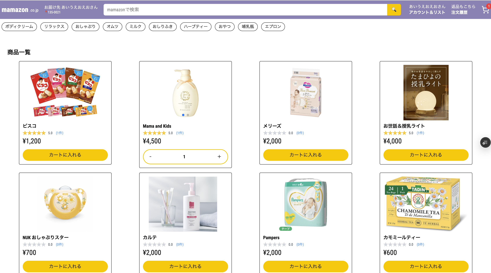
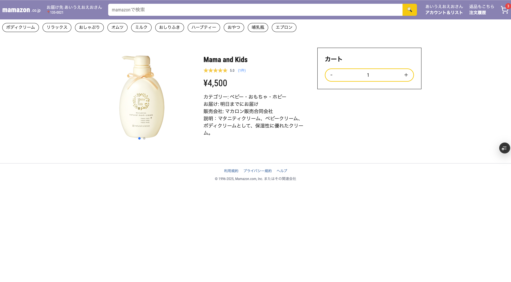
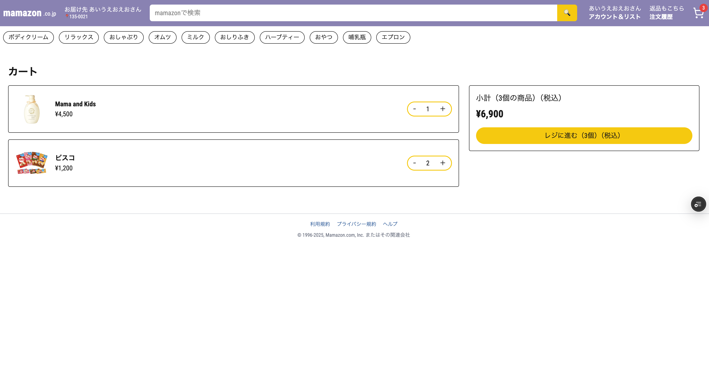
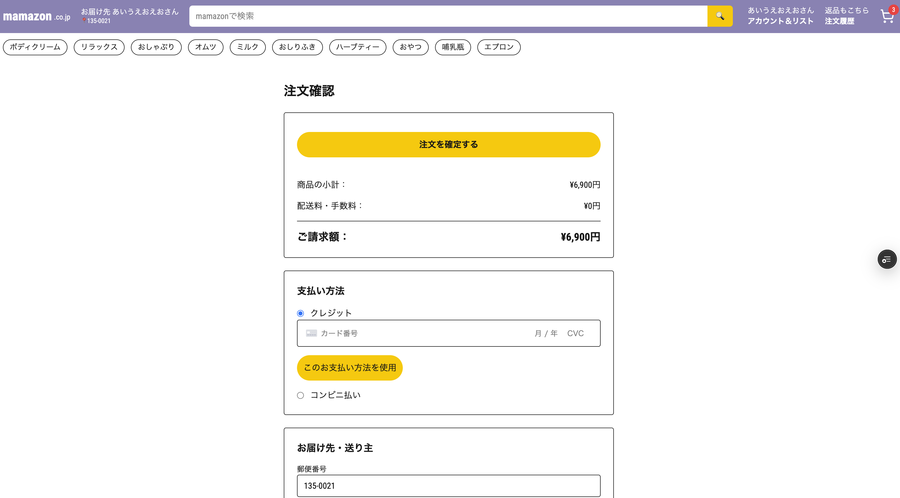
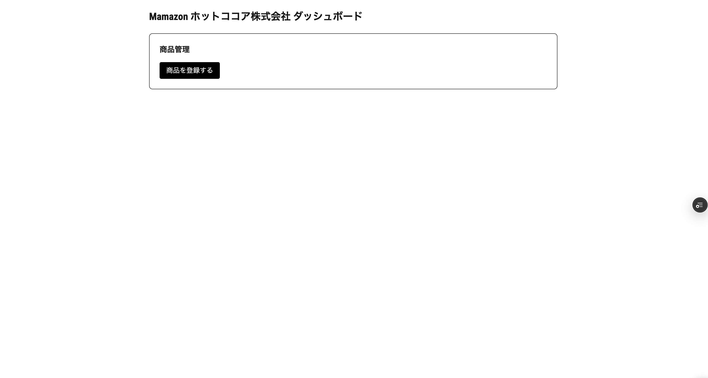
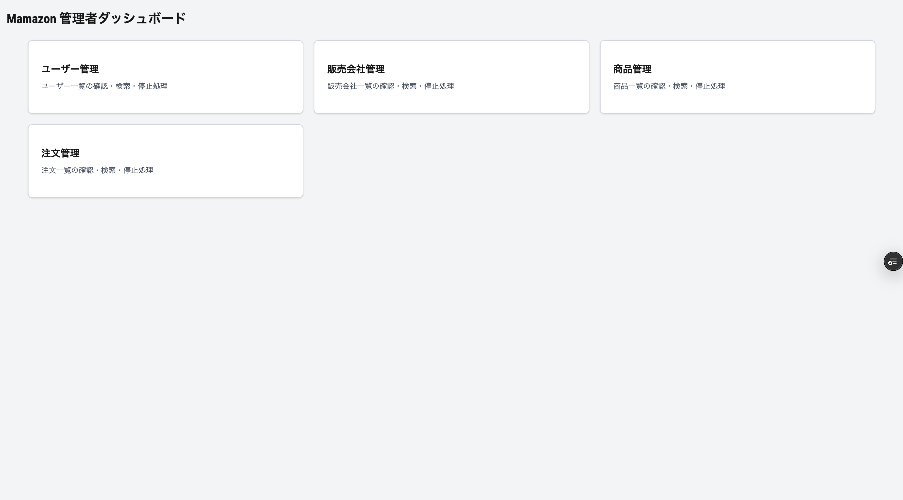
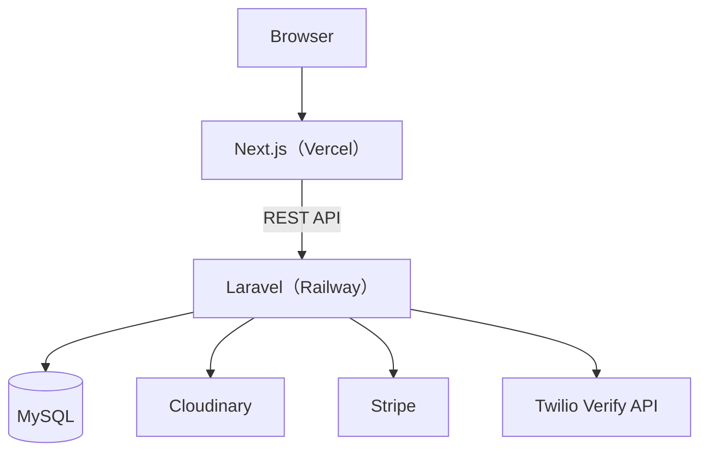
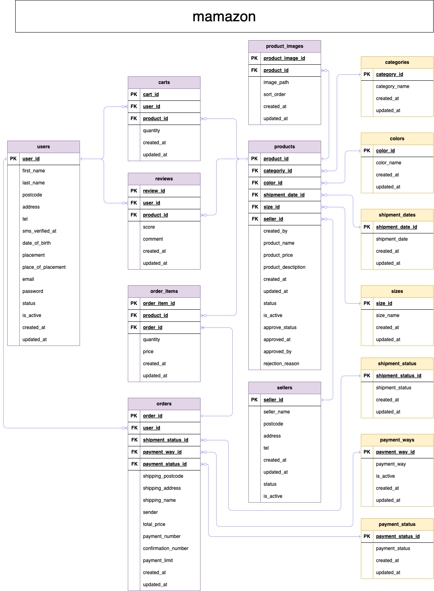

# Mamazon

## アプリ概要

Mamazon は、Amazon を参考に制作したポートフォリオ用の EC サイトです。

一般ユーザー・販売会社・管理者それぞれに対応した画面・機能を提供しています。

- **ユーザー**：商品の閲覧・検索、カートへの追加、購入、レビュー投稿など
- **販売会社**：商品の登録申請（仮登録）
- **管理者**：販売会社が登録申請した商品の承認、商品管理、ユーザー管理、販売会社管理、注文管理

販売会社が登録した商品は管理者の承認後に公開される仕組みとなっています。

フロントエンドには Next.js、バックエンドには Laravel を採用し、API を介して通信する SPA（Single Page Application）構成で開発しました。

## 制作背景

今後エンジニアとして力を伸ばしたいという思いから、できる限り実務を意識した形で開発をしたく、本アプリを制作しました。

一番の目的は、Laravel と Next.js を組み合わせた API開発について学ぶことです。

また、Cloudinary を利用した画像アップロード機能や、Stripe（テストモード）を利用したクレジットカード決済機能、SMS認証なども、実務を意識して導入したものです。

本番環境へのデプロイには Railway と Vercel を利用しました。

まだまだ追加したい機能や改善したい部分はありますが、ひとまず当初思い描いていたところまでは形にできたので公開に至りました。

## URL

- **アプリ（トップページ）** : https://20260221-atsukonakazawa-mamazon.vercel.app

- **アプリ（販売会社ダッシュボード）** : https://20260221-atsukonakazawa-mamazon.vercel.app/seller/dashboard

- **アプリ（管理者ダッシュボード）** : https://20260221-atsukonakazawa-mamazon.vercel.app/admin

  > ※販売会社・管理者の認証機能は今後実装予定です。現在はポートフォリオ用として各画面へ直接アクセスできます。

- **GitHub** : https://github.com/atsukonakazawa/20260221_atsukonakazawa_mamazon

## テストアカウント

### ユーザー

- メールアドレス : aiueo@eo.com
- パスワード : aaaaaaaa

  > ※SMS 認証を試す場合は別途お問い合わせください。

## 使用技術

### Frontend

- Next.js 16.1.6
- React 19.2.4
- TypeScript 5.9.3
- Tailwind CSS 4.2.1
- Swiper 12.2.0

### Backend

- Laravel 8.83.29
- PHP 8.3.12

### Database

- MySQL

### Infrastructure

- Railway
- Vercel

### External Services

- Cloudinary
- Stripe（テストモード）
   > ※クレジットで注文を試す場合、クレジットカード番号は4242 4242 4242 4242でお願いいたします。
- Twilio Verify API

## 主な機能

### ユーザー機能

- ユーザー登録
- SMS 認証
- ログイン
- ログアウト
- 商品一覧表示
- 商品検索
- 商品詳細表示
- カート機能
- 注文機能
- 注文履歴の一覧表示
- レビュー投稿
- アカウント情報更新

### 販売会社機能

- 商品登録申請（仮登録）

### 管理者機能

- 仮登録商品の承認
- 商品の管理（検索・ソート・一覧・詳細・編集・停止・再開・削除）
- ユーザーの管理（検索・ソート・一覧・詳細・編集・停止・再開・退会）
- 販売会社の管理（検索・ソート・一覧・詳細・編集・停止・再開・削除）および新規登録
- 注文の管理（検索・ソート・一覧・詳細）

### その他

- Cloudinary による画像アップロード
- Swiper による商品画像スライダー
- 郵便番号から住所自動取得
- コンビニ払い用の支払い番号を自動生成
- SMS 認証によるパスワード再設定
- Toast による操作結果の通知

## 画面イメージ

### トップページ

### 商品詳細画面

### カート画面

### 注文画面

### 販売会社ダッシュボード

### 管理者ダッシュボード

## システム構成

## ER 図

## 工夫した点

実装するだけでなく、実務に近い構成や使いやすさを意識し、以下の点を工夫しました。

- **商品公開フロー**
  販売会社が登録申請した商品を、管理者が承認後に公開する仕組みを導入しました。

- **SMS 認証**
  Twilio Verify API を利用し、ユーザー登録やパスワード再設定時に SMS 認証を導入しました。

- **画像管理**
  Cloudinary を利用して画像を管理し、複数画像は Swiper でスライド表示できるようにしました。

- **API 設計**
  フロントエンドとバックエンドを分離し、Laravel と Next.js が API を介して通信する構成で開発しました。

- **UI/UX**
  Toast による操作結果の通知や、郵便番号から住所を自動取得する機能を実装し、使いやすさを意識しました。

## 今後追加したい機能

- 販売会社・管理者の認証機能
- SMS 認証コードの再送機能
- 販売会社へのお問い合わせ機能
- 販売会社側でのお問い合わせ対応機能および出荷処理機能
- ユーザー・管理者が配送状況を確認できる機能
- 商品お気に入り登録機能
